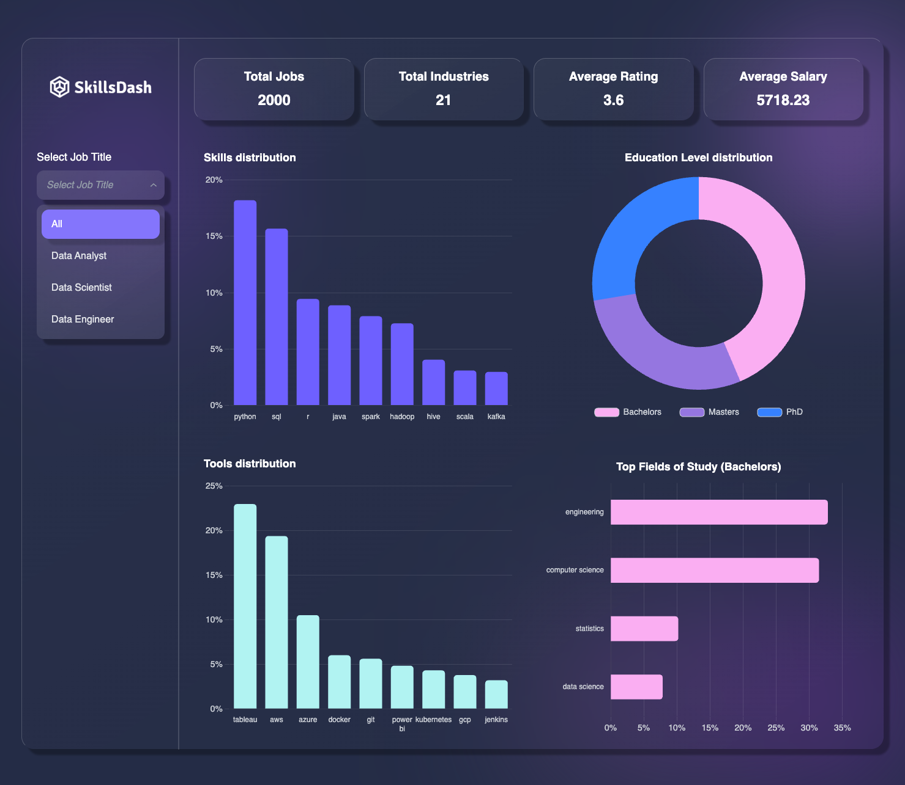
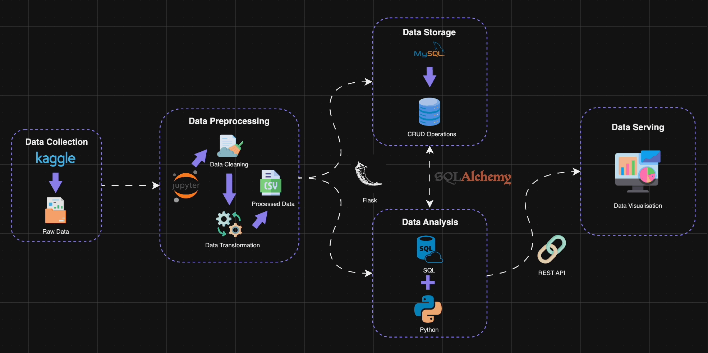

<h1 style="background-color: #9c8ffd; height:200px">
    
</h1>

   A modern job skills dashboard 📊

  
  
  
  
  

##

  

## 💡 Motivation
A simple dashboard to provide quick insights into the most sought after skills and software tools for data science related roles in Singapore. Many hiring portals often list a multidude of job requirements which can overwhelm job seekers, so it would be valuable to summarise all the key requirements across numerous job postings. This intuitive design hopes to provide an immediate overview of job requirements so that job seekers would know which skills and tools to focus on.

## 🛠️ Built With
### Backend
[![Python][Python]][Python-url] [![Flask][Flask]][Flask-url] [![MySQL][MySQL]][MySQL-url]

### Frontend
[![React][React.js]][React-url] [![Chart.js][Chart.js]][Chart-url] [![TailwindCSS][TailwindCSS]][Tailwind-url]

## 📊 Data pipeline

## 🚀 Usage
COMING SOON!

<!-- MARKDOWN LINKS & IMAGES -->
<!-- https://www.markdownguide.org/basic-syntax/#reference-style-links -->
[Python]: https://img.shields.io/badge/python-3670A0?style=for-the-badge&logo=python&logoColor=ffdd54
[Python-url]: https://www.python.org/
[Flask]: https://img.shields.io/badge/flask-%23000.svg?style=for-the-badge&logo=flask&logoColor=white
[Flask-url]: https://flask.palletsprojects.com/
[MySQL]: https://img.shields.io/badge/mysql-4479A1.svg?style=for-the-badge&logo=mysql&logoColor=white
[MySQL-url]: https://www.mysql.com/
[React.js]: https://img.shields.io/badge/react-%2320232a.svg?style=for-the-badge&logo=react&logoColor=%2361DAFB
[React-url]: https://reactjs.org/
[Chart.js]: https://img.shields.io/badge/chart.js-F5788D.svg?style=for-the-badge&logo=chart.js&logoColor=white
[Chart-url]: https://www.chartjs.org/
[TailwindCSS]: https://img.shields.io/badge/tailwindcss-%2338B2AC.svg?style=for-the-badge&logo=tailwind-css&logoColor=white
[Tailwind-url]: https://tailwindcss.com/